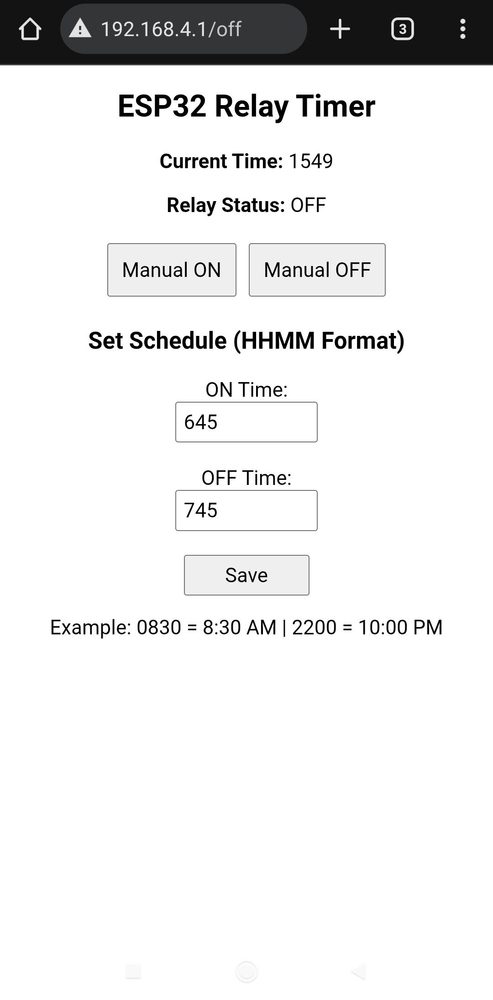
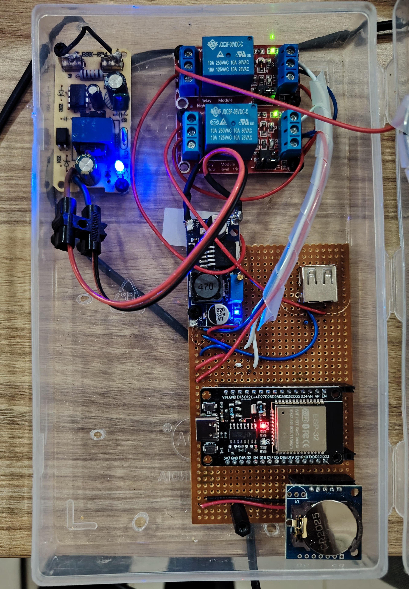

# ESP32 Web-Based Relay Timer with Manual Override

This project is a web-controlled relay timer system built using an ESP32.
It allows users to control electrical loads through a web interface with both automatic scheduling and manual override functionality.

---
## 📷 Project Overview

🌐 Web Control Interface

  

The ESP32 hosts a built-in web server that allows you to:

View current time
    
Check relay status (ON / OFF)
    
Manually turn relay ON
    
Manually turn relay OFF
    
Set ON time (HHMM format)
    
Set OFF time (HHMM format)
    
Save schedule settings

Example time format:

    0645 → 6:45 AM
    
    2200 → 10:00 PM

## 🔧 Hardware Implementation

  

Main Components Used

ESP32 Development Board – Main controller with WiFi

DS3231 RTC Module – Real-time clock with backup battery

Dual 5V Relay Module – Controls external loads

DC-DC Buck Converter – Voltage regulation

5V SMPS Power Supply – AC to DC conversion

CR2032 Battery – RTC backup

Perfboard custom wiring

Plastic enclosure box

## ⚙️ Features
✅ Automatic Scheduling

  Relay turns ON at preset ON time
  
  Relay turns OFF at preset OFF time
  
  Same-day schedule (no overnight intervals)

✅ Manual Override

  Manual ON works at any time
  
  Manual OFF immediately turns relay OFF
  
  If manually turned ON during schedule, relay still turns OFF automatically at OFF time

✅ Web-Based Control

  Works over local WiFi network
  
  No cloud required
  
  Access via ESP32 IP address (e.g., 192.168.4.1)

✅ Reliable Timekeeping

  DS3231 RTC ensures accurate time
  
  Maintains time during power loss

## 🧠 Control Logic Priority

OFF time has highest priority

Manual override allowed anytime

Automatic schedule runs when manual override is inactive

## 🚀 How to Use

Power ON the system

Connect to ESP32 WiFi

Open browser and enter IP address

Set ON and OFF time

Click Save

Use Manual ON / OFF when needed

## 🔌 Safety Notice

⚠️ This system switches high-voltage loads.

Ensure proper insulation

Use correct relay rating

Secure all wiring

Disconnect power before servicing

## 📌 Future Improvements

* Multiple relay control

* NTP time synchronization

* Mobile-optimized UI

* EEPROM schedule storage

* MQTT / IoT integration
